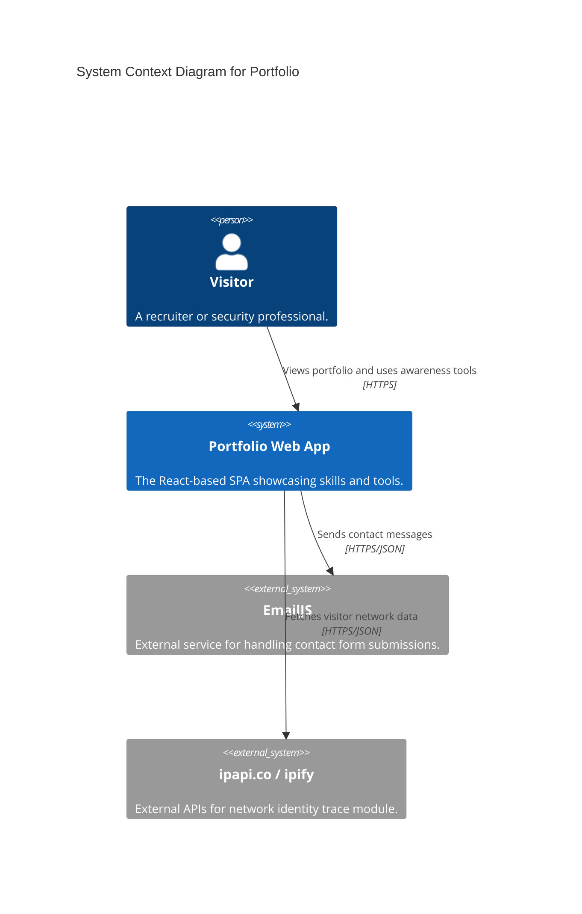
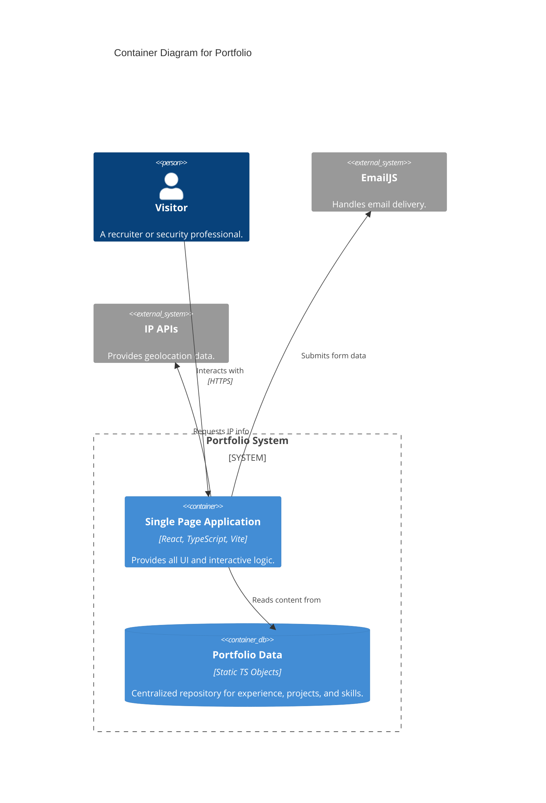
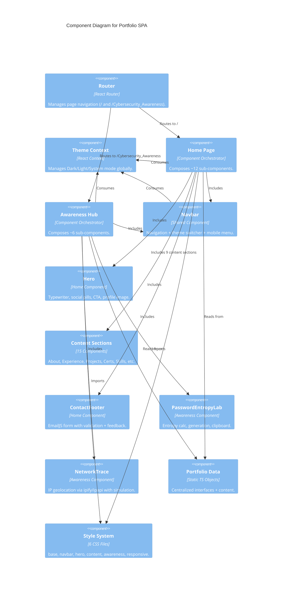

# Architecture Documentation: Philopater Shenouda Portfolio

This document describes the software architecture of the **Cybersecurity Portfolio** application using the **arc42** template and the **C4 Model** for visual representation.

---

## 1. Introduction and Goals

### 1.1 Requirements Overview
The primary goal is to provide a high-performance, visually engaging professional portfolio for a Junior Penetration Tester.
Key features include:
- Professional experience and certification gallery.
- **Cybersecurity Awareness Hub**: Interactive tools for security education.
- Responsive design with a "Cyber-Hacker" aesthetic.
- Global theme management (Light/Dark/System).
- Mobile-safe portfolio presentation with constrained hero content, responsive navigation, and overflow-resistant cards.
- Optimized media delivery for the first viewport and below-the-fold content.

### 1.2 Quality Goals
1.  **Performance:** Rapid loading using Vite and optimized assets.
2.  **Type Safety:** Robust implementation using TypeScript to minimize runtime errors.
3.  **Maintainability:** Clear separation of data (`portfolioData.ts`) from UI components.
4.  **UX/UI:** Fluid animations and interactive security simulations.
5.  **Responsive Robustness:** Layouts should remain usable and visually consistent from small mobile widths through desktop screens.
6.  **Frontend Safety:** External links, browser APIs, and optional third-party integrations should fail gracefully.

---

## 2. C4 Model - Visual Representation

### 2.1 Level 1: System Context
Shows how the Portfolio interacts with its environment.



### 2.2 Level 2: Containers
Zooming into the application itself.



### 2.3 Level 3: Components
Key internal structural elements of the SPA.



---

## 3. arc42 - Detailed Documentation

### 3.1 Solution Strategy
- **Framework:** React 19 for efficient UI rendering via the Virtual DOM.
- **Interactivity:** `framer-motion` for complex entry animations and interactive states.
- **Type System:** TypeScript with strict interfaces for all data structures (Experiences, Projects, etc.).
- **Build Tool:** Vite for ultra-fast development and optimized production bundling (hashing, code-splitting).

### 3.2 Building Block View (Static Structure)
The source code is organized as follows:

**Components (`src/components/`)**
Each UI section is isolated in its own component for maintainability and reusability:
- `Navbar.tsx` — Shared navigation bar with theme switcher and responsive hamburger menu.
- `Hero.tsx` — Landing hero with typewriter effect, social pills, and CTA buttons.
- `Typewriter.tsx` — Reusable typewriter animation component.
- `SectionHeader.tsx` — Reusable section header with numbering.
- `AboutSection.tsx`, `ExperienceSection.tsx`, `EducationSection.tsx`, `ProjectsSection.tsx` — Career content sections.
- `TestimonialsSection.tsx` — Auto-sliding testimonial image carousel.
- `CertificationsSection.tsx` — Credly badges + certification list.
- `VolunteeringSection.tsx`, `SkillsSection.tsx`, `LanguagesSection.tsx` — Additional profile sections.
- `ContactFooter.tsx` — Contact form with EmailJS integration.
- `ScrollToTop.tsx` — Floating back-to-top button.
- `PasswordEntropyLab.tsx`, `SecurityChecklist.tsx`, `FormulaCard.tsx` — Cybersecurity awareness tools.
- `BruteForceAnalysis.tsx`, `TimeToCrack.tsx`, `NetworkTrace.tsx` — Additional awareness modules.

**Data (`src/data/`):**
- `portfolioData.ts` — Pure TypeScript objects (interfaces + static data). No UI logic.

**Pages (`src/pages/`):**
- `Home.tsx` — Composes all home-page components (~30 lines of orchestration).
- `CybersecurityAwareness.tsx` — Composes awareness hub components (~100 lines).
- `Resume.tsx` — Print-friendly resume with inline styles.

**Styling (`src/styles/`):**
- `base.css` — CSS custom properties, reset, body, background glow, keyframes.
- `navbar.css` — Navigation, theme switcher, mobile drawer styles.
- `hero.css` — Hero, social pills, status badge, CTA buttons.
- `content.css` — All content sections (about, skills, experience, projects, certs, volunteering, languages, testimonials, footer, contact form, scroll-to-top).
- `awareness.css` — Cybersecurity awareness page (entropy lab, checklist, trace, time scale).
- `responsive.css` — All media queries across breakpoints (1200px → 380px).

**State (`src/`):**
- `ThemeContext.tsx` — Global light/dark/system theme via React Context + localStorage.

**Entry:**
- `App.tsx` — Router setup + CSS imports.
- `main.tsx` — React DOM root mount.

### 3.3 Deployment View
The application is deployed via **GitHub Actions** to **GitHub Pages**.

```mermaid
deployment
    title Deployment View
    
    Node(github_cloud, "GitHub Infrastructure", "Cloud") {
        Node(gh_pages, "GitHub Pages", "Static Web Hosting") {
            Artifact(dist, "Production Build", "HTML/JS/CSS/Assets")
        }
    }
    
    Node(visitor_browser, "Visitor Browser", "Client") {
        Artifact(app_runtime, "Running Portfolio", "React Instance")
    }

    Rel(visitor_browser, gh_pages, "Requests application via HTTPS")
    Rel(gh_pages, visitor_browser, "Delivers static assets")
```

### 3.4 Cross-cutting Concerns
- **Theme Consistency:** Managed via `data-theme` attribute on `<html>` and React Context.
- **Responsive Design:** Mobile-first approach using CSS Media Queries and a dynamic Hamburger menu.
- **Security Awareness Logic:** Cryptographic entropy is calculated using mathematical formulas ($E = \log_2(R^L)$) implemented in JavaScript.
- **Overflow Control:** Global and component-level `max-width`, `min-width: 0`, and `overflow-wrap` rules prevent horizontal scrolling caused by long titles, badges, buttons, cards, and grid content.
- **Responsive Navigation:** On small screens, the theme switcher is hidden and the hamburger menu is explicitly shown to preserve header space and avoid right-side clipping.
- **Responsive Hero Layout:** The hero image, name, subtitle, social links, and CTA buttons use constrained mobile widths. The profile name is intentionally rendered as two lines on mobile.
- **Responsive Grids:** Skills, projects, certifications, languages, awareness cards, and trace items use `minmax(min(..., 100%), 1fr)` to avoid fixed minimum widths overflowing small screens.
- **Image Loading:** Above-the-fold profile media uses explicit dimensions and high fetch priority, while secondary images use lazy loading and async decoding.
- **External Link Safety:** External links opened in new tabs use `rel="noopener noreferrer"`.
- **Fluid Typography:** Uses CSS `clamp()` for the Hero title (e.g., `clamp(2.5rem, 8vw, 4rem)`) to ensure smooth scaling between mobile and desktop without abrupt breakpoints.
- **Scroll Management:** Global `scroll-padding-top: 100px` is applied to the HTML root to prevent fixed navigation headers from obscuring section titles during anchor-link transitions.
- **UX Stability:** Critical interactive elements (like the Typewriter title) have defined `min-height` to prevent Layout Shift (CLS) during text animations.
- **Enhanced Clipboard Feedback:** The awareness tool uses a three-state transition (IDLE -> COPIED/FAILED -> IDLE) with visual color cues and disabled states to provide clear feedback for browser API interactions.
- **Browser API Resilience:** Clipboard interactions guard against empty values and report copy failure instead of assuming browser support.

---

## 4. Technical Risks and Decisions
- **Decision:** Using `localStorage` for theme persistence to ensure the user's preference is remembered across sessions.
- **Decision:** Decoupling `portfolioData.ts` from UI components to allow content updates without modifying UI logic.
- **Risk:** External IP APIs may block requests (Ad-blockers/Rate limits). *Mitigation:* Implemented a "Simulation Mode" in the Trace module.
- **Decision:** Hide the theme mode control on mobile widths and keep the hamburger menu visible. This prioritizes navigation reliability over exposing every desktop control in the narrow header.
- **Decision:** Force the portfolio name into two lines on mobile. This prevents clipped text in the hero section and provides a predictable first-screen layout.
- **Decision:** Keep EmailJS client integration in the frontend, while relying on provider-side template/domain controls for operational restrictions.
- **Risk:** Headless browser screenshots may not perfectly match a user's cached GitHub Pages build. *Mitigation:* Validate with `npm.cmd run build`, local preview, and hard refresh/cache clearing when testing deployed pages.
- **Risk:** Third-party scripts such as Credly embeds can fail or load slowly. *Mitigation:* Load the script dynamically and keep certification content available independently.

---

## 5. Recent Change Log

### 5.8 SEO, Resilience & Performance Hardening (July 2026)
- **Security:** Resolved all 10 `npm audit` findings (5 high-severity, in `react-router`/`react-router-dom`/`vite`) via non-breaking `npm audit fix`.
- **SEO:** Added meta description, Open Graph, Twitter Card, canonical URL, and a JSON-LD `Person` schema to `index.html`; added `public/robots.txt` and `public/sitemap.xml`.
- **Branding:** Replaced the default Vite favicon with a custom terminal-icon SVG (`public/favicon.svg`) matching the site's neon-cyan cyber aesthetic; added `public/og-image.jpg` for social share previews.
- **Performance:** `CybersecurityAwareness` and `Resume` pages are now lazy-loaded via `React.lazy`/`Suspense` in `App.tsx`, splitting them out of the main bundle (each now a separate ~10KB chunk instead of bundled into the ~415KB main chunk visitors get on `/`).
- **Resilience:** Added `ErrorBoundary` (`src/components/ErrorBoundary.tsx`) wrapping the app, so a component crash shows a fallback screen instead of a blank page. Covered by tests.
- **Cleanup:** Removed the unused `serve` devDependency (the PDF generation script actually uses `vite preview`).

### 5.7 Tooling: Git, Tests, CI, Spec Kit (July 2026)
- **Version control:** Initialized the git repository (it previously had no `.git` history despite README instructions referencing `git clone`).
- **Duplicate cleanup:** Removed a fully duplicated `Portfolio-main/Portfolio-main/` directory (a zip-extraction artifact) that mirrored the entire project.
- **Testing:** Added Vitest + React Testing Library. `calculateEntropy` extracted from `PasswordEntropyLab.tsx` into `src/utils/passwordEntropy.ts` with unit tests; added component tests for `PasswordEntropyLab` and `ThemeContext`. `npm run test` / `npm run test:watch` added.
- **Refactor:** `PasswordEntropyLab.tsx` derives entropy/strength/color via `useMemo` instead of `useState` + `useEffect`, fixing a `react-hooks/set-state-in-effect` lint error and removing an unnecessary render pass.
- **Lint fixes:** Removed dead `useTheme()` calls in `NetworkTrace.tsx` and `PasswordEntropyLab.tsx` (destructured `theme` was never used).
- **CI:** Added `.github/workflows/ci.yml` running lint, typecheck, test, and build on every push/PR to `main`.
- **EmailJS secrets:** `deploy.yml` now injects `VITE_EMAILJS_*` from GitHub Actions repository secrets at build time. The hardcoded fallback values in `ContactFooter.tsx` remain as a legacy gap — see Section 4 risks.
- **Spec Kit:** Initialized GitHub Spec Kit (`.specify/`, `.claude/skills/speckit-*`) with a `constitution.md` authored from this document's Quality Goals and Cross-cutting Concerns sections. Future features should flow through `/speckit-specify` → `/speckit-plan` → `/speckit-tasks` → `/speckit-implement`.

### 5.6 Component Refactoring & CSS Split (July 2026)
- **Navbar extracted:** Duplicated nav code from `Home.tsx` and `CybersecurityAwareness.tsx` unified into a single `Navbar.tsx` component using `useLocation` for active-state detection.
- **Page decomposition:** `Home.tsx` (909 lines → ~30) split into 12 focused components under `src/components/`. `CybersecurityAwareness.tsx` (923 lines → ~100) split into 6 components.
- **CSS split:** Monolithic `App.css` (2003 lines) replaced with 6 modular files under `src/styles/`: `base.css`, `navbar.css`, `hero.css`, `content.css`, `awareness.css`, `responsive.css`.
- **Inline styles converted:** All `style={{...}}` in the Awareness page moved to CSS classes in `awareness.css`.
- **Typewriter extracted:** Inline `Typewriter` component extracted to `src/components/Typewriter.tsx` for reuse.
- **EmailJS credentials:** Hardcoded keys replaced with `VITE_EMAILJS_*` environment variables (with fallback defaults). Added `.env.example`.
- **Data deduplication:** Removed duplicate `about.phone` in `portfolioData.ts` (was redundant with `contact.phone`).
- **Accessibility:** Added `aria-label`, `aria-current`, and `role="tab"` to testimonial slider dots.
- **Verification:** `npx tsc --noEmit` and `npx vite build` both pass cleanly.

### 5.1 Responsive and UX Hardening
- Added global overflow guards for `html`, `body`, images, buttons, inputs, and major page roots.
- Reworked mobile hero constraints to prevent horizontal clipping on small screens.
- Split the hero name into separate spans and render it as two lines on mobile.
- Reduced mobile CTA widths and centered them consistently.
- Hid the theme switcher on mobile and explicitly kept the hamburger menu visible.
- Added safer responsive behavior for section headers, experience cards, project cards, certification items, contact form fields, and awareness cards.

### 5.2 Performance and Asset Handling
- Optimized `src/assets/profile.jpg` from about 1.94 MB to about 107 KB.
- Added explicit image dimensions, async decoding, high priority for the hero image, and lazy loading for secondary images.
- Prevented the testimonials auto-slider interval from starting when there is only one or zero images.

### 5.3 Safety and Browser Behavior
- Added `rel="noopener noreferrer"` to external links using `target="_blank"`.
- Improved clipboard copy behavior in the awareness page with disabled states and failure feedback.
- Preserved build compatibility with Vite and TypeScript after the responsive updates.

### 5.4 Verification
- `npm.cmd run lint` passes.
- `npm.cmd run build` passes.
- Local production preview was used to inspect the mobile first viewport around 390 px width.

### 5.5 UX Polishing and Fluid Typography
- **Fluid Typography:** Implemented `clamp()` for the hero title to provide seamless text scaling across all device widths.
- **UX Stability:** Fixed layout shifts in the hero section by defining a consistent `min-height` for animated typewriter elements.
- **Navigation UX:** Added global `scroll-padding-top` to prevent fixed header overlap during anchor navigation.
- **Clipboard Intelligence:** Enhanced the awareness tool with a robust 3-state clipboard handler (IDLE, SUCCESS, FAILURE) to improve interaction transparency.
- **Accessibility:** Ensured all interactive elements have appropriate disabled states and visual feedback during processing.
